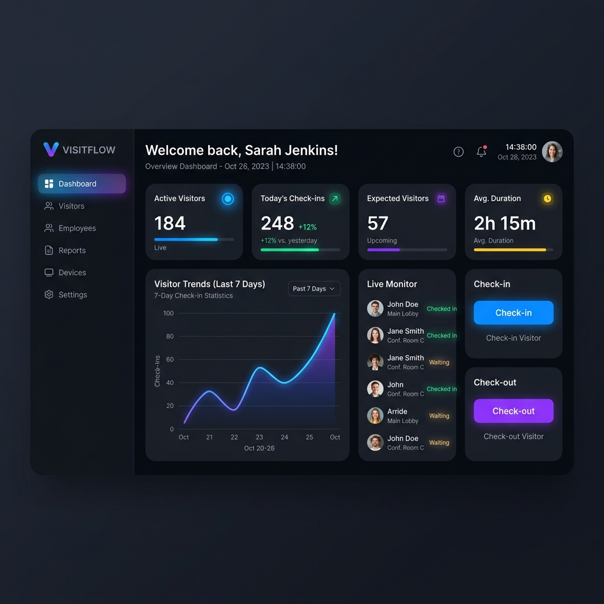
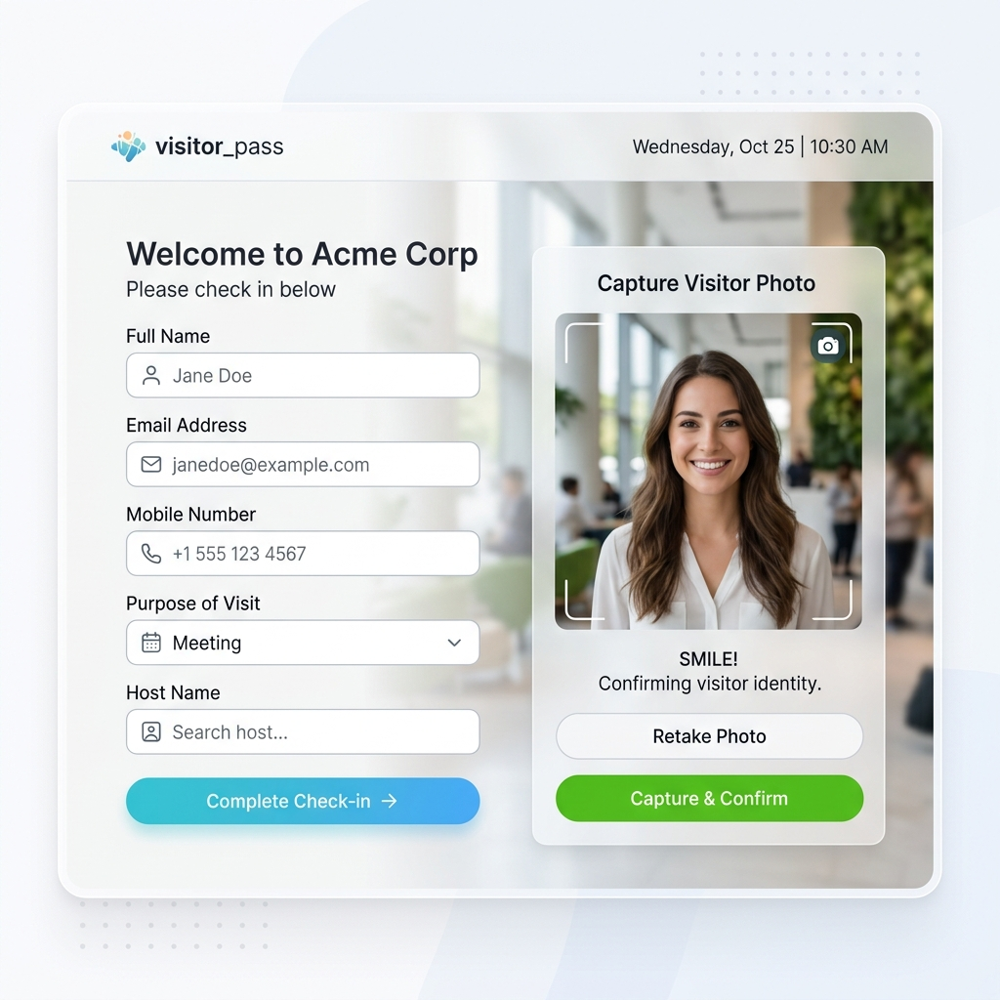

# 🏢 Visitor Management System (VMS)

[](https://www.php.net/)
[](https://www.mysql.com/)
[](https://getbootstrap.com/)
[](LICENSE)

An elegant, secure, and user-friendly digital utility for front-desk receptionists to seamlessly register and manage company visitors, replacing traditional, bulky paper logs.

---

## 🎨 User Interface Mockups

Here is a visual preview of the Visitor Management System's modern design and dashboard architecture:

| 📊 Admin Dashboard | 📝 Visitor Registration |
| :---: | :---: |
|  |  |

---

## ✨ Features

- **📊 Modern Dashboard**: Instant analytics on total check-ins, active (online) visitors, and logged-out history.
- **📝 Easy Registration**: Intuitive form to record guest names, contact info, meeting purposes, and hosts.
- **📸 Webcam Support**: Capture visitor photos in real-time during registration.
- **🕒 Real-time Logs**: Keep track of automatic Time-In and Time-Out timestamps.
- **🔍 Quick Search & View**: Retrieve visitor logs, receipt IDs, and detailed fields.
- **🔒 Secure Authentication**: Built-in login protection for receptionists.

---

## 🛠️ Technology Stack

- **Backend**: PHP (MySQLi connections)
- **Frontend**: HTML5, CSS3, JavaScript, jQuery
- **UI Framework**: Bootstrap v3
- **Media**: WebcamJS library integration for hardware capture

---

## 🗄️ Database Setup & Structure

The project relies on a MySQL database named `db_vms`. Import the `db_vms.sql` file to set up the structure.

### 📋 Table: `info_visitor`
Stores the detailed check-in records for all visitors.

| Field Name | Data Type | Key / Extra | Description |
| :--- | :--- | :--- | :--- |
| **Serial** | `int(11)` | `PRIMARY KEY` (Auto-Increment) | Unique log ID |
| **Name** | `char(50)` | | Visitor's full name |
| **Contact** | `bigint(10)` | | Phone number |
| **Purpose** | `varchar(100)` | | Purpose of visit |
| **meetingTo** | `varchar(100)` | | Person being visited |
| **day** | `varchar(50)` | | Day of visit |
| **month** | `int(2)` | | Month of visit |
| **year** | `int(4)` | | Year of visit |
| **Date** | `date` | | Current date |
| **TimeIN** | `time` | | Check-in time |
| **ReceiptID** | `int(6)` | | Automatically generated receipt code |
| **Status** | `varchar(100)` | | Online/Offline status |
| **Comment** | `varchar(100)` | | Notes or description |
| **TimeOUT** | `time` | | Check-out time |
| **registeredBy** | `varchar(30)` | | Logging user username |
| **loggedOutBy** | `varchar(30)` | | Logout registrar username |
| **imagePath** | `varchar(100)` | | Path to visitor webcam capture |
| **StudentName** | `varchar(40)` | | Optional reference name |
| **courseYear** | `int(1)` | | Optional course year reference |
| **Hostel** | `varchar(80)` | | Optional hostel details |

### 🔑 Table: `login_info`
Stores registrar / receptionist user credentials.

| Field Name | Data Type | Key / Extra | Description |
| :--- | :--- | :--- | :--- |
| **SnoPrimary** | `int(11)` | `PRIMARY KEY` (Auto-Increment) | User serial number |
| **userName** | `varchar(30)` | | Login username |
| **pass** | `varchar(30)` | | Login password |

---

## 🚀 Installation & Local Setup

1. **Clone the Repository**:
   ```bash
   git clone https://github.com/vijaymahes9080/Visitor-Management-System-PHP.git
   ```
2. **Move to Server Directory**:
   Place the project folder inside your local server's web directory (e.g., `htdocs` for XAMPP or `www` for WampServer).
3. **Database Configuration**:
   - Start your Apache and MySQL servers.
   - Access `phpMyAdmin` and create a database named `db_vms`.
   - Import the `db_vms.sql` file provided in the repository.
   - Adjust `db_connect_Login.php` and `db_connect_db_new.php` with your local database credentials if necessary.
4. **Run Application**:
   Open your browser and navigate to `http://localhost/Visitor-Management-System-PHP/index.php`.

---

## 👨‍💻 Author

Developed and maintained by **Vijay Mahes**
- **Email**: [Vijaypradhap2004@gmail.com](mailto:Vijaypradhap2004@gmail.com)
- **GitHub**: [@vijaymahes9080](https://github.com/vijaymahes9080)
